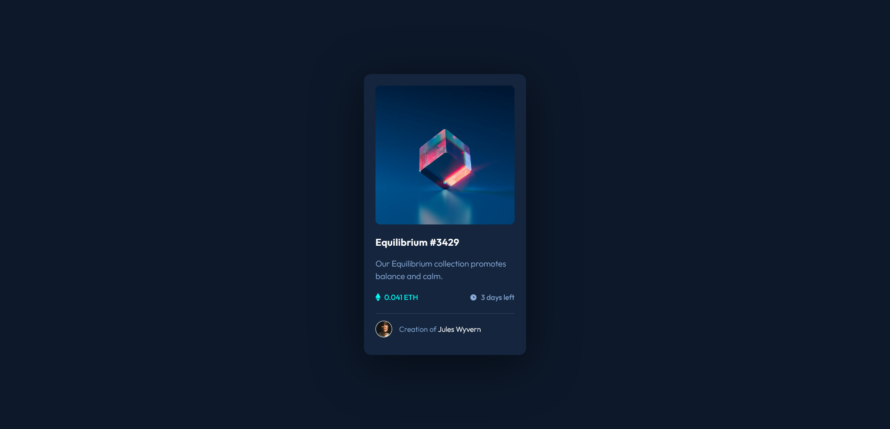

# Frontend Mentor - NFT preview card component solution

This is a solution to the [NFT preview card component challenge on Frontend Mentor](https://www.frontendmentor.io/challenges/nft-preview-card-component-SbdUL_w0U). Frontend Mentor challenges help you improve your coding skills by building realistic projects.

## Table of contents

- [Overview](#overview)
  - [The challenge](#the-challenge)
  - [Screenshot](#screenshot)
  - [Links](#links)
- [My process](#my-process)
  - [Built with](#built-with)
  - [What I learned](#what-i-learned)
  - [Continued development](#continued-development)
  - [Useful resources](#useful-resources)
- [Author](#author)
- [Acknowledgments](#acknowledgments)

## Overview

The challenge was to build a responsive NFT Preview Card component and get it looking as close to the design as possible using tools of my choosing.

### The challenge

Users should be able to:

- View the optimal layout depending on their device's screen size
- See hover states for interactive elements

### Screenshot

### Links

- Solution URL: [Add solution URL here](https://your-solution-url.com)
- Live Site URL: [Add live site URL here](https://your-live-site-url.com)

## My process

I built the component using a mobile-first approach. I incorporated BEM methodology for class assignment and used CSS variable for key styles. I also used Flexbox to align key elements effectively.

### Built with

- Semantic HTML5 markup
- CSS custom properties
- Flexbox
- BEM methodology
- Mobile-first workflow

### What I learned

I learned how to apply an overlay to a html element and animate the transition of it's opacity to produce a smoother effect when hovering and focusing over the main image of the card.

### Continued development

I'll begin attempting more complex designs by using a combination of Flexbox and Grid.
